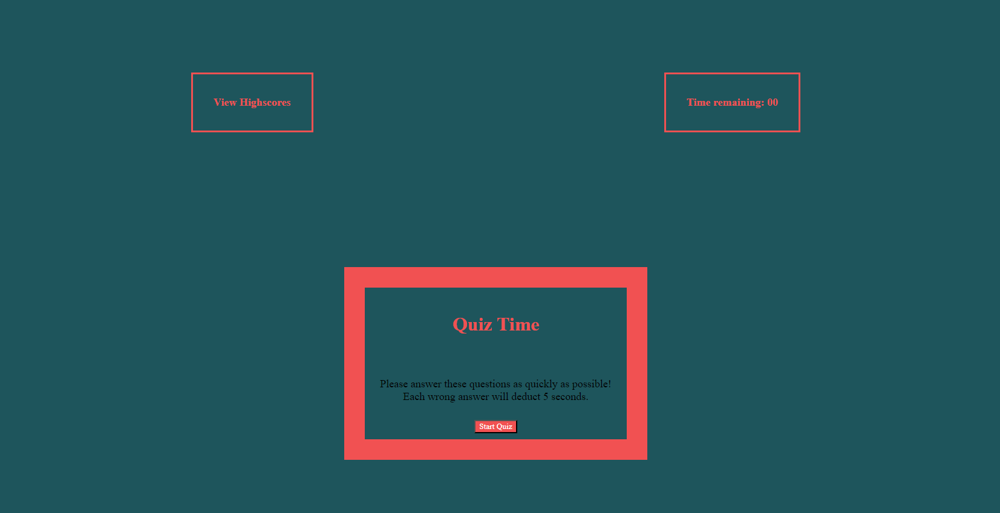

# Testing-The-Quiz
A timed coding quiz with multiple-choice questions

## Description
* My motivation for this project was to create a timed coding quiz for programmers wanting to test their knowledge.
* I created this quiz to exercise my knowledge of JavaScript and jQuery while creating as fun quiz.
* This project allows programmers to test their knowledge against the clock while being deducted 5 seconds for each wrong answer.
* I learned that dedicating your time and putting in the work is both rewarding and enlightening. I learned a lot and feel more confident in myself than I did previously.
* I feel that my project stands out because it is a piece of me that I put lots of hardwork and time into it so that I could feel proud of how far I have already come in the program.

Screenshot of page

Link to page
 https://dnttstme.github.io/Testing-The-Quiz/

## Installation
N/A

## Usage

# User
You will select "Start Quiz". From there, a 60 second timer will begin and you will be asked relevant coding questions. Each wrong answer deducts 5 seconds from your time. Once completed, the time stops. You will be prompted to submit your intials and submit them to a score board.

## Credits

https://www.youtube.com/watch?v=riDzcEQbX6k

https://en.owl.institute/javascript-fundamentals/

javascript-manipulating-html-with-ease/using-multiple-js-files

https://coolors.co/507255-0f0a0a-bfc3ba-b33951-8c2f39

https://www.w3schools.com/js/js_htmldom.asp

https://www.youtube.com/watch?v=PBcqGxrr9g8

https://www.w3schools.com/cssref/sel_root.php

https://simplestepscode.com/javascript-quiz-tutorial/

https://www.youtube.com/watch?v=WUBhpSRS_fk

## License
Please refer to the License in the repository. 